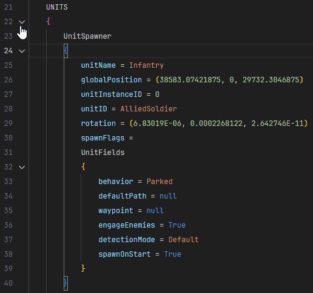

# vtol-vr-confignode README

This extension adds language support for VTOL VR's ConfigNode files.

## Features

- Syntax highlighting
- Proper section folding
- Snippets
  - `v3`: Inserts `(x, y, z)` with tabstopped placeholders
  - More soon!

## Release Notes

### 0.0.1

Initial preview release
